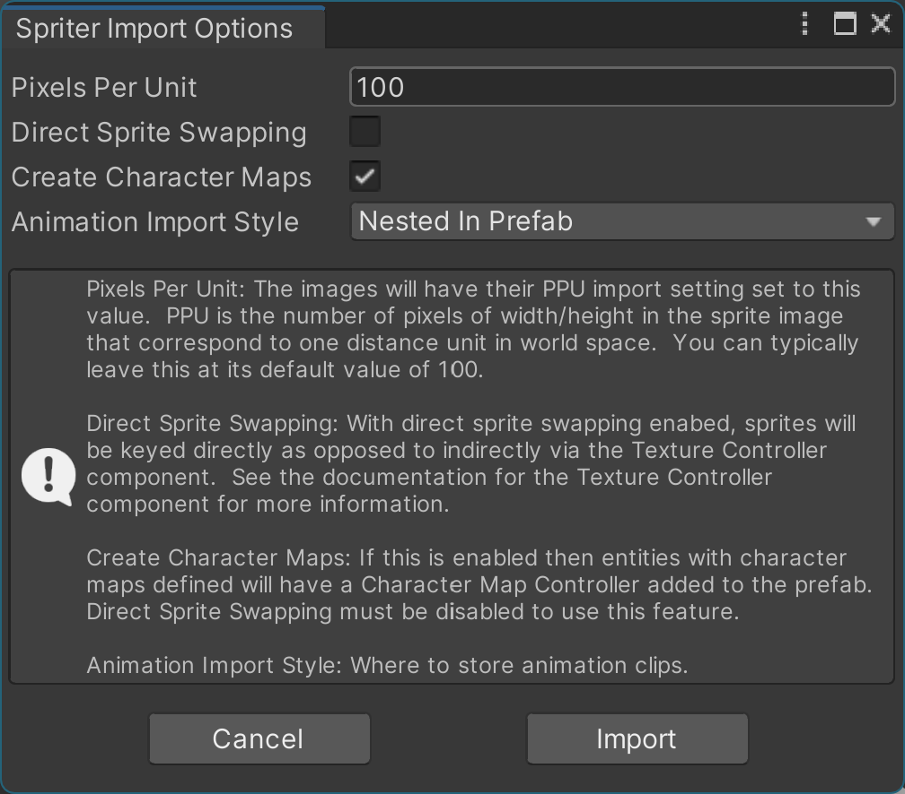

# Spriter2UnityDX Reanimated 😎

>re·an·i·mate  
/rēˈanəˌmāt/  
verb  
past tense: **reanimated**; past participle: **reanimated**  
>   * restore to life or consciousness; revive.  
>   * give fresh vigor or impetus to.  

## Description
Spriter2UnityDX helps you integrate Spriter projects into Unity.  It imports Spriter .scml files and the images that it references and produces the following as output:

* **Prefabs**  
One prefab will be generated for each of the entities in the .scml file.  The prefab's preview image will be generated based on the first frame of the entity's first animation.
* **Animator controllers**  
One animator controller will be generated for each of the entities.  An animation state will be created for each of the entity's animations.
* **Animation clips**  
One animation clip will be generated for each of an entity's animations.  These are standard Unity animation clips that can be played/scrubbed in-editor using Unity's Animator window.  If the structure of the Spriter file permits it, you can use Unity animation features such as crossfade and transition blending.

## Why this fork?

This is a custom fork of the Spriter2UnityDX project.  It adds a lot of new functionality.  The main focus of the fork is on animation visual fidelity.  That is, matching Spriter's animation playback as much as practical.  It aims to be lightweight and allocation-free.

## Where to get Spriter2UnityDX and how to install it

You have two simple options for installation: grab the UnityPackage from Releases, or install directly from source.

1. **Install via Unity Package** 
    1. Grab the latest Unity package from [here.](https://github.com/TerminalJack/Spriter2UnityDX/releases) Unlike the Github repo (which is a complete Unity project), the Unity package will have only the files you need for integration into your own Unity project. 
    2. Drag-and-drop the package into your project's `Project` window. 
    3. In the import dialog, click `Import`.
2. **Install from Source** 
    1. Clone or download the full repo: 
    `git clone https://github.com/TerminalJack/Spriter2UnityDX.git` 
    2. In your OS file browser, locate the Spriter2UnityDX folder inside the repo. 
    3. Drag-and-drop that folder into your Unity `Project` window.

> The default installation location is `Assets/Spriter2UnityDX` but you can rename the folder and/or move it into another folder such as `Assets/Plugins/` or `Assets/3rdParty/`.

## Quick start!

Once Spriter2UnityDX is installed you can import a Spriter project simply by dropping the folder that contains the .scml file--**and** all of the image files needed by the .scml file--into the Unity `Project` window.

Dropping a Spriter project folder into Unity's `Project` window will kick-off Unity's importers (for the image files) and, once Unity is done, it will hand control to Spriter2UnityDX to import the .scml file.  A window with a few import options will pop-up at this time.  For now, simply leave the import options as-is and click the `Import` button.

This will import all of the contents from all of the .scml files that are found in the folder and its subfolders.  The importer will ignore Spriter's `autosave` files so don't worry about them being present during import.

The importer will write its generated output files (the prefabs, etc.) into the same folder as the corresponding .scml file.  Depending on import settings, animation clips can be embedded in the prefab or written into a subfolder.

> Important!  Some Spriter .scml files contain **a lot** of information to process.  It can take several minutes (up to 15 minutes!) to do an import.  ***Be patient.***  Unity will be unresponsive at this time but be assured that Unity isn't 'locked up'.  If you're worried, you can open a file browser and monitor the importer's progress by checking for the presence of the importer's output files.  If possible, you should start with a small, simple Spriter project.

Once the import is complete, check the folder for newly created prefab files.  There will be one for each entity in the .scml file(s).  If you click on one of these prefabs you will see that its preview image is generated from the first frame of the entity's first animation.

Drop one of these prefabs into the `Scene` view.  Open Unity's `Animation` window.  Select the game object (the instantiated prefab) in the `Scene` view and select an animation clip in the `Animation` window.  Hit the play animation button (▶️) and the animation will play.

>This assumes that that particular clip actually had an animation.  Creators wll often use one or more Spriter animations as a static guideline or template, from which they base their actual animations off of.  If the clip doesn't actually animate anything then try another one.

A quick and easy way to play through all of a prefab's animation clips is to use the `Clip Runner` component.  You'll find this component in the `Extras/` folder.  Put a `Clip Runner` component on the root of the game object.  (Where the `Animator` component is located.)

Leave the properties as-is and run the scene.  (Leave the `Cross Fade` property unchecked, in particular.)  This will run each of the animation clips in the game view.

Assuming that all has gone well, you are ready to use the generated prefabs, animation clips, etc. in your next masterpiece.

If you need to reimport a .scml file at any time, right-click the file and click `Reimport`.  This will attempt to integrate any changes that have been made to the the .scml file into the existing prefabs and animator controllers.  The reimport will overwrite the animation clips but it will attempt to preserve any animation events that you have added.

If there have been drastic changes to the .scml file since the prefab was last generated then reimporting over an existing prefab may seemingly corrupt the prefab.  At this point, the importer isn't particularly robust in this regard.  See the `Tips and Tricks` section on how to avoid (or at least minimize) putting any customizations in the hierarchy of the prefab.  If you do this then you can simply delete the prefab before reimporting to ensure that there are no issues with reimporting on top of a preexisting prefab.

Finally, before you go and play with the newly generated prefabs, be wary when trying to use Unity's transition blending feature.  When you create a transition from one animator state to another, Unity will, by default, blend the two animations.

For Spriter projects, the biggest factor as to whether this works or not depends on how different the bone hierarchy is between the two animations.  If they are different in any way then you will likely have sprites that go flying off in seemingly random directions during the transition.  This applies when using the `Animator.CrossFade()` method as well.  If you run into this issue then you will either need to change the bone hierarchy in Spriter or completely disable transition blending for the affected animator states.

## Supported versions of Unity.

The importer and the generated prefabs, animator controllers, animation clips, and the runtime library are all supported by Unity version 2019 and later.  The importer's output is **not** tied to the same version of Unity that produced it.  That is, you can produce the prefabs, animator controllers, and animation clips in Unity 2019 and use them as-is in Unity version 6.1 and vice-versa.

## Supported pipelines.

The importer and its output will work with the built-in renderer (aka BiRP) as well as the Universal Render Pipeline (URP.)

## Supported development platforms.

As of this writing the only development platform that has been tested is Windows.  If you try the importer on another development platform then please let me know how it goes!

## Supported runtime platforms.

The only runtime platforms that have been tested at this time are Windows and WebGL.  Please let me know how it goes for the other runtime platforms.

## Supported Spriter features.

The importer currently supports the following Spriter features:

* **All Spriter easing curve types.**  Instant (aka constant), linear, quadratic, cubic, quartic, quintic, and Bézier curves are all converted to Unity animation curves with high visual fidelity.
* **Dynamic reparenting.**  Spriter allows the artist to reassign a bone/sprite's parent at any time of an animation.  The importer will emulate this functionality by creating a `virtual parent` for the bones and sprites that have more than one parent (across all of the entity's animations.)  This is also known as a `parent constraint` or `child of constraint` in animation applications.
* **Non-default / dynamic pivots.**  Spriter allows a sprite's pivot to change at any time of an animation.  The importer fully supports this via a `dynamic pivot` component.
* **Sort order or z-index.**  Sprites can change their sort order frame-by-frame.  This is fully supported via the `Sprite Renderer` `Order in layer` property.

## Unsupported Spriter features.

The following Spriter features are not supported at this time:

* Character maps
* Variables
* Triggers
* Tags
* Sounds
* Collision rectangles
* Action points
* SCON files (an alternative to SCML files)
* Sub-entities
* Texture Packer atlases
* Bone alpha
* *Animated* bone scales

> Note about bone alpha: Spriter allows a bone's transparency (aka alpha) to be animated.  This affects the sprites that are children of the bone.

> Note about bone scales: Strictly speaking, the importer supports a bone changing its scale.  It will not *tween* (i.e. animate) a bone's scale, however.

## Import options.

The `Spriter Import Options` window will appear whenever you either, a) drop a Spriter project into Unity's `Project` window, or, b) right-click an .scml file and select `Reimport`.

You'll be given the option to set the options shown in the figure below.

Once you have selected the appropriate options, click the `Import` button to proceed with the import.  Click `Cancel` to dismiss the window and cancel the import.

Unless you have a specific need to change the `Pixels Per Unit` value, it is best to leave it as-is with its default value of 100.

The `Native Sprite Swapping` checkbox should be disabled if you intend to use texture controllers.  See the description for the `Texture Controller` component for more information.

The `Animation Import Style` has the two options: `Nested In Prefab` and `Separate Folder`.  If you select `Separate Folder`, a prefab's animation clips will be placed in a subfolder named "{*prefabName*}_Anims".

## Runtime components.

The following components are used at runtime (and in some cases, in-editor) to supplement the animations generated by the importer.  The components will be found in the prefab's hierarchy when and where they are needed.

### `Dynamic Pivot 2D`

A Dynamic Pivot 2D component will be used in the case where--if in any of an entity's animations--a sprite uses a pivot point that is different than its default.  The entity's animation clips will then have animation curves that set the pivot's `X` and `Y` properties as appropriate.

When a Dynamic Pivot 2D component is used the sprite renderer will be placed on a child transform and the pivot component will adjust the child transform's position to take the pivot point into account.  The animation curves that move, rotate, scale, and set the sprite's sort order will be done to the transform containing the pivot component and not the transform containing the sprite renderer, as is done normally.

### `Sorting Order Updater`

This component is responsible for updating its corresponding sprite renderer's `Order in Layer` property, where larger values indicate sprites that are closer to the camera.  The `Sorting Order Updater` component will either be on the same game object as the sprite renderer or, if the sprite requires a `Dynamic Pivot 2D` component, it will be on the same game object as the pivot component.  (See the image under the description of the `Dynamic Pivot 2D` component for an example of this.)

The 'sorting order' roughly corresponds to Spriter's z-index.  Spriter's z-index (its value multiplied by -0.001, to be exact) is stored in the `localPosition.z` property of either the pivot's transform, if any, or the sprite render's transform.

>Large values (negative *or* positive) aren't used so that the sprites stay within the camera's clipping space.

This component updates the sprite renderer during `LateUpdate()`.  The value of `Order in Layer` will be in increments of 10.  This is to allow for custom sprite renderers to be mixed-in with those of the prefab.

### `Sprite Visibility`

See the description of the `Sorting Order Updater` component for an image that includes the `Sprite Visibility` component.

This component is responsible for enabling or disabling its corresponding sprite renderer.  Newer versions of Unity don't allow boolean properties to be animated so this component is basically a hack to get around that.

The component's `Is Visible` property will be set by animation curves when a sprite needs to be visible or not.  A value of 0 will hide the sprite.  A value of 1 will show it.

### `Texture Controller`

>Whether `Texture Controllers` are created, or not, is determined at the time of import.  Uncheck the `Native Sprite Swapping` checkbox to create texture controllers.

When a sprite has more than one texture (across all animations) a `Texture Controller` component can be used as a kind of proxy that sits between the animation clips and the sprite renderer.  This comes in handy for when you want to do things such as 're-skin' your character or have different textures based on a status such as heath.

When a sprite has more than one texture, *without* the texture controller component, animation clips will overwrite a sprite's texture with whatever is specified in the animation clip.  This is due to the fact that the clips animate the `SpriteRenderer.Sprite` property directly.

*With* the texture controller component, animation clips will (indirectly) select the sprite renderer's texture based on the `Displayed Sprite` property, which is an index into the `Sprites` array.  You can then place your re-skinned textures into the `Sprites` array and not have to worry about the animation clips overwriting your customizations.

Sprites that have only a single texture across all animations will not have a `Texture Controller` component.  In this case, `SpriteRenderer.Sprite` isn't being animated so you can simply put your custom texture directly into it.

### `Virtual Parent`

If you're familiar with Parent Constraints or Child-of Constraints then you will already understand the purpose of the `Virtual Parent` component.

When a transform has a virtual parent component, the component will make children of that transform behave as though they are children of a parent other than their actual parent.  This is how the importer deals with the fact that Spriter allows the creator to re-parent bones and sprites at any time during an animation.

Unity animation clips require the paths to properties that it animates remain static.  For this reason, you can't move a game object/transform around in the hierarchy when it has properties that are being animated.  That is, you can't actually re-parent transforms via animation.

Bones and sprites that have more than one parent (across all animations) will have a `Virtual Parent` component created to deal with switching between parents during animations.  The importer will populate the `Possible Parents` array and animation clips will select the appropriate parent via the `Parent Index` property.

>Unity has a `Parent Constraint` component but it isn't used due to the fact that it doesn't work in-editor when playing/scrubbing animation clips.

See the **Tips and tricks** section for some other handy uses for the `Virtual Parent` component.

## The Prefab's Bind Pose

The **bind pose** (also called the rest pose or default pose) is the reference state of a prefab before any animation is applied. It’s defined by the first frame of the entity’s first animation and also determines the prefab’s preview image.

If a prefab has many virtual parents then some thought should be given to which animation is used to define the bind pose.  Ideally, you want to use a bind pose that will exploit a particular optimization in the `Virtual Parent` component.

### What the Bind Pose Includes

- Transform properties
  - Position, rotation, scale
- Rendering properties
  - Sprite image, sorting order, visibility, alpha
- Constraint properties
  - Virtual parent assignments, pivot points

### How Unity, the Importer, and Spriter Use the Bind Pose

- When you drop a prefab into the Scene view, it appears in its bind pose.
- Spriter doesn't have the concept of a bind pose but, so far as the importer is concerned, in the Spriter application, dragging an animation into the top-most row makes that animation's first frame the bind pose.
- During import, the importer compares each animatable property against its bind-pose value. If a property never deviates then the importer skips generating an animation curve for it. At runtime, channels without curves automatically fall back to their bind pose values, reducing clip size, memory usage, and sampling overhead.

### Virtual Parent Optimization

During import, each `Virtual Parent` component is configured so that its "actual parent" in the hierarchy matches the parent defined in the first frame of the entity's first animation.

- If `Parent Index == 0` (virtual parent equals actual parent), the component simply resets its transform.
- This reset code path skips constraint solving entirely, offering a significant performance boost over full constraint evaluation.

### Choosing the Best Bind Pose

1. Identify the pose most representative of your common animations.
2. Ensure virtual parents in that pose line up with their actual parents to trigger the reset-only code path.
3. (Optional) Apply the same principle to pivot points when they’re in use.

By selecting a bind pose that matches your typical animation scenarios, you maximize the use of these optimizations.

## Tips and tricks.

**Sprite Atlases**

The single biggest performance boost you can gain with the prefabs generated from Spriter is to use a `Sprite Atlas` with them.  If you create an empty scene, throw a prefab into the scene view, click run, and click the `Stats` button, you will notice that the number of batches (basically draw calls) is more-or-less the same as the number of visible sprites that the Spriter entity is composed of.  This can be dozens!

Once you have dozens of characters on-screen the number of draw calls can easily exceed 500 to 1000.

You can reduce the number of draw calls down to 1 per Spriter entity simply by creating a (single!) `Sprite Atlas` for all of the images that the entity is composed of.  Creating a sprite atlas is simple but it is beyond the scope of this document to go into details.  Just be sure Unity generates a single sprite atlas!  If all of the images don't fit into a single atlas then Unity will create as many as needed but this will defeat the purpose of using them!  The number of draw calls may be reduced but it almost certainly will not be just 1 draw call.

Many commercial Spriter projects come with images that are much bigger than you would normally use in-game.  You may need to use Spriter Pro's `Save as resized project` feature to reduce the size of the images so that you can fit them all in a single sprite atlas.

**Mip Maps**

Something to be aware of with regard to Unity's sprite renderer, is that it uses simple UV texture sampling to get a sprite's texture from GPU memory to the screen.  That is, there isn't any texture filtering done.  Basically, what this means is that if, for example, the image in the GPU's memory is twice as large as it will be rendered on-screen then only every other pixel will be sampled when generating the output.

This can result in sprites that have jagged edges.  The simple solution to this is to enable mip maps via the `Sprite Atlas`'s `Generate Mip Maps` property.  (You *are* using sprite atlases, right?)

>From Wikipedia: In computer graphics, a mipmap (mip being an acronym of the Latin phrase multum in parvo, meaning "much in little") is a pre-calculated, optimized sequence of images, each of which has an image resolution which is a factor of two smaller than the previous.  Their use is known as mipmapping.

Another option to fix this is to use Spriter Pro's `Save as resized project` feature.  This will allow you to generate images that are basically "pixel perfect" so that the images don't need to be stretched or compressed.

>This is actually a bit more complicated than it is made out to be since this assumes that you are either a) supporting just a single resolution for your game, or b) will generate separate image sets (and atlases) for each of the resolutions you intend to support.  A good 'middle ground' is to use Spriter Pro's `Save as resized project` feature to generate pixel perfect images at you game's maximum supported resolution **and** enable mip maps.

**A Strategy for Keeping Customizations out of Generated Prefabs**

Because it is likely that you will eventually need to regenerate a prefab, it is advised that you keep all customizations out of the prefab.  This way you will be able to simply delete the old prefab and reimport without fear of losing any customizations.

This approach treats the prefab as the read-only visual representation (aka `skin` or `model`) of a character while customizations such as logic, colliders, etc. are placed elsewhere in the game object's hierarchy.

One approach is to make the prefab a child of another game object.  The root game object would be where all, or most, of the custom scripts are placed.

If you find that you need to add something such as a collider or a sprite renderer to one of the model's transforms then it is advised that you, instead, create an empty transform as a child of the root, add a `Virtual Parent` component to it, and make the target transform (the transform you want the collider, sprite renderer, etc. attached to) the sole `Possible Parent` of the virtual parent.  Any components that you place on the virtual parent, or its children, will essentially be a child of the target's transform and move, rotate and scale based on it.

>If you have added custom sprite renderers then be sure to 1) add these to the sprite atlas, and 2) move the `Sorting Group` component from the model's prefab up into the root game object.

## Caveats.

While the importer strives to convert your Spriter projects into Unity animations, it doesn't necessarily focus on making those animations easy to edit in Unity.  You will likely find that it is better to continue using Spriter for animation creation and editing.

If you need to expand or contract an animation, prefer to do so in Spriter rather than in Unity.  For parent and pivot changes, Spriter actually uses two keys that have the exact same time.

Having two keys at the same frame time isn't possible in Unity so, to handle these cases, the importer will use two different keys that have--at import time--just half a millisecond of difference in their times.  The problem is that expanding an animation in Unity also means expanding the distance between these keys--which can cause problems.

On the flip side, contracting an animation in Unity risks having the editor drop keys that are too close to each other.  This is also one of the reasons why Spriter animation clips must be imported with a sample rate of 1000 frames per second.

>Stretching and contracting an animation in Spriter has its risks as well.  Creators will often place a key just 1 millisecond after another with the intention of instantly changing the key value(s).  Stretching the animation in this case will instead cause the value to tween between the two keys.  So be mindful in either case.

## Known Issues.

During an import, having a Spriter project open in the Spriter application can (infrequently) cause the import to fail.  You will get an error regarding file access.  You may need to close the Spriter application in this case.

There may be issues with key timing during parent and/or pivot changes.  This may not always be noticeable during normal playback because it happens for just one frame.  (Spriter projects have a framerate of **1000 frames per second!**)  Slowly scrubbing through the frames at the point of a parent/pivot change may reveal that the keys aren't properly synchronized.  For a single frame the affected sprite(s) will have an incorrect position, rotation and/or scale.  This can usually be corrected in the Unity `Animation` window by moving the master keyframe (the topmost key in the dopesheet) a single frame to the **right** and then back to the left.

## License.

This fork has the same license as the original project.  The text of which is as follows:

> This project is open source. Anyone can use any part of this code however they wish. Feel free to use this code in your own projects, or expand on this code. If you have any improvements to the code itself, please visit https://github.com/Dharengo/Spriter2UnityDX and share your suggestions by creating a fork
-Dengar/Dharengo

## Credits.

I, [TerminalJack](https://github.com/TerminalJack), would like to thank the original creator of the Spriter2UnityDX project, [Dharengo](https://github.com/Dharengo) as well as contributors to the project [rfadeev](https://github.com/rfadeev) and [Mazku](https://github.com/Mazku).

## FAQs.

### Why are the animation clips set to a sample rate of 1000?  Isn't that a little excessive?

The sample rate is set to 1000 due to the fact that that is Spriter's effective sample rate.  In Spriter, there is nothing stopping the creator from putting two keyframes just 1 millisecond apart.  Experience has shown that when the sample rate is too low that Unity can and will drop keys when they are too close to each other.

Using the same sample rate as Spriter also allows Unity to be frame-for-frame identical to Spriter.  You will find the keys at the exact same frame time in Unity as you do in Spriter.
